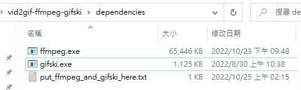

# vid2gif-ffmpeg-gifski
Simple batch scripts for making high quality compressed gifs from videos on Windows.

# Installation

You need to have [ffmpeg](https://ffmpeg.org/download.html#repositories) and [gifski](https://gif.ski/) first.

Download the binary execuations from their official website.

## FFmpeg Binary
You can find the binary from the any one of following links: 

**Download command-line binary instead of GUI application**

* https://ffmpeg.org/download.html#repositories
* https://www.gyan.dev/ffmpeg/builds/ ----> ffmpeg-5.0.1-essentials_build.zip
* https://github.com/BtbN/FFmpeg-Builds/releases ----> ffmpeg-master-latest-win64-gpl.zip

## Gifski Binary:
You can find the binary from the any one of following links: 

**Download command-line binary instead of GUI application**
* https://gif.ski/
* https://github.com/ImageOptim/gifski/releases ----> gifski-1.7.2.tar.xz

## Put `ffmpeg.exe` and `gifski.exe` into the `/dependencies/`


# Usage
## Drag and drop
Just drag your video file into `vid2gif_prompt_mode.bat` and set the parameters by prompt.

https://user-images.githubusercontent.com/23000374/197606381-fa4de710-5d74-42cb-96f1-bcd56fb17030.mp4


Or `vid2gif_600w_20fps_q90.bat` to make a gif with default params.

https://user-images.githubusercontent.com/23000374/197606357-d7fa8d8b-d9f1-4eea-91a1-d386ab2356bf.mp4


## Command-line

https://user-images.githubusercontent.com/23000374/197606405-7bfb5779-875b-4454-977d-9cfeceedd0a0.mp4

## `vid2gif_prompt_mode.bat`
The prompt mode will ask you parameters.
```
vid2gif_prompt_mode.bat <input>
```
## `vid2gif_600w_20fps_q90.bat`
The default conversion from video to gif with 600 width, 20 fps, 90 quality.
```
vid2gif_600w_20fps_q90.bat <input>
```
## `vid2gif_600w_50fps_q80.bat`
A high framerate but low quality preset.
```
vid2gif_600w_50fps_q80.bat <input>
```
## `vid2gif_600w_50fps_q90.bat`
A high framerate and quality preset.
```
vid2gif_600w_50fps_q90.bat <input>
```
## `scripts\to_gif_gifski_cmd.bat`
FFmpeg to extract the image sequence and Gifski to make a high quality gif.
```
.\scripts\to_gif_gifski_cmd.bat <input> <output> <width> <fps> <quality>
```
## `scripts\to_gif_ffmpeg_cmd.bat`
FFmpeg directly convert a video file to a gif.
```
.\scripts\to_gif_ffmpeg_cmd.bat <input> <output> <width> <fps>
```

# Parameters


|  Name   |                                     Description                                     |
| :-----: | :---------------------------------------------------------------------------------: |
|  input  |               the filename  of the source video. (e.g. `myvideo.mp4`)               |
| output  |                 the filename of the output gif. (e.g. `myGif.gif`)                  |
|  width  |                     the width of the output gif.  (default 600)                     |
|   fps   |                    the framerate of the output gif. (default 20)                    |
| quality | the compression quality of the gif [0 - 100] (See [gifski page](https://gif.ski/)). |