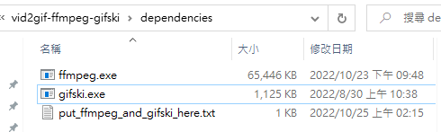

# vid2gif-ffmpeg-gifski
[[English](/README.md) / [中文](/README_ZH.md)]

一個用於將影片檔轉換成高品質高壓縮率 GIF 的小工具（以 Windows Batch 撰寫，不支援其他作業系統）

- [vid2gif-ffmpeg-gifski](#vid2gif-ffmpeg-gifski)
- [安裝](#安裝)
  - [FFmpeg 執行檔](#ffmpeg-執行檔)
  - [Gifski 執行檔](#gifski-執行檔)
  - [把 `ffmpeg.exe` 和 `gifski.exe` 放進 `/dependencies/` 目錄內](#把-ffmpegexe-和-gifskiexe-放進-dependencies-目錄內)
  - [(可選) 把指令添加到右鍵選單中的 '傳送到'](#可選-把指令添加到右鍵選單中的-傳送到)
    - ['傳送到'的實作原理是什麼?](#傳送到的實作原理是什麼)
- [使用方法](#使用方法)
  - [滑鼠拖曳](#滑鼠拖曳)
  - ['Send to'(傳送到) Menu.](#send-to傳送到-menu)
  - [命令列模式](#命令列模式)
    - [`vid2gif_prompt_mode.bat`](#vid2gif_prompt_modebat)
    - [`vid2gif_600w_20fps_q90.bat`](#vid2gif_600w_20fps_q90bat)
    - [`vid2gif_600w_50fps_q80.bat`](#vid2gif_600w_50fps_q80bat)
    - [`vid2gif_600w_50fps_q90.bat`](#vid2gif_600w_50fps_q90bat)
    - [`scripts\to_gif_gifski_cmd.bat`](#scriptsto_gif_gifski_cmdbat)
    - [`scripts\to_gif_ffmpeg_cmd.bat`](#scriptsto_gif_ffmpeg_cmdbat)
- [參數說明](#參數說明)
  - [Aspect Ratio](#aspect-ratio)

# 安裝

你需要先下載 [ffmpeg](https://ffmpeg.org/download.html#repositories) 和 [gifski](https://gif.ski/) 。

可以從他們的官方網站直接下載執行檔。

## FFmpeg 執行檔
你可以從以下連結**擇一**下載 ffmpeg 的執行檔：

**請下載命令列工具而非 GUI 應用程式**

* https://ffmpeg.org/download.html#repositories
* https://www.gyan.dev/ffmpeg/builds/ ----> ffmpeg-5.0.1-essentials_build.zip
* https://github.com/BtbN/FFmpeg-Builds/releases ----> ffmpeg-master-latest-win64-gpl.zip

## Gifski 執行檔
你可以從以下連結**擇一**下載 Gifski 的執行檔：

**請下載命令列工具而非 GUI 應用程式**

* https://gif.ski/
* https://github.com/ImageOptim/gifski/releases ----> gifski-1.7.2.tar.xz

## 把 `ffmpeg.exe` 和 `gifski.exe` 放進 `/dependencies/` 目錄內


## (可選) 把指令添加到右鍵選單中的 '傳送到'
把一個你想要加入選單中的 `.bat` 檔案**拖曳**至 `add_bat_to_sendto_menu.bat` 檔案內，然後為這個快捷指令命名。
> 警告: 如果你之後改變了 `vid2gif-ffmpeg-gifski` 這整個資料夾的位置的話，以上的快捷指令會失效。

https://user-images.githubusercontent.com/23000374/198987721-cc5ee054-e858-4076-881a-6f294eac1c79.mp4


### '傳送到'的實作原理是什麼?
按下 `Win`+`R` 並且輸入 `Shell:sendto` ， 你會打開一個 `SendTo` 資料夾，而這底下的所有東西就是右鍵選單中的'傳送到'的捷徑。

你可以把任意檔案捷徑拉近 `SendTo` 資料夾藉以製作屬於自己的捷徑。

# 使用方法
## 滑鼠拖曳
只要把你想要轉換的**影片檔案**使用滑鼠將其拖曳進 `vid2gif_prompt_mode.bat` 之中，然後把你需要輸出的 GIF 參數輸入進去即可。
（相關參數代表意義請洽底下 [參數說明](#參數說明)）

https://user-images.githubusercontent.com/23000374/197606381-fa4de710-5d74-42cb-96f1-bcd56fb17030.mp4


或者你不打算自己輸入參數的話我有預製幾組常用參數可以直接使用，例如 `vid2gif_600w_20fps_q90.bat` 。

https://user-images.githubusercontent.com/23000374/197606357-d7fa8d8b-d9f1-4eea-91a1-d386ab2356bf.mp4

## 'Send to'(傳送到) Menu.
如果你有照著前面的安裝流程設定好了'傳送到'快捷選單的話，你可以直接對影片檔右鍵，傳送到，<你設定的指令.bat>，便可以進行轉換。
([安裝指示](#可選-把指令添加到右鍵選單中的-傳送到))


https://user-images.githubusercontent.com/23000374/198987697-d22ee6e9-226f-4918-9481-ad60ba81c502.mp4

## 命令列模式

https://user-images.githubusercontent.com/23000374/197606405-7bfb5779-875b-4454-977d-9cfeceedd0a0.mp4

### `vid2gif_prompt_mode.bat`
The prompt mode will ask you parameters.
```
vid2gif_prompt_mode.bat <input>
```
### `vid2gif_600w_20fps_q90.bat`
The default conversion from video to gif with 600 width, 20 fps, 90 quality.
```
vid2gif_600w_20fps_q90.bat <input>
```
### `vid2gif_600w_50fps_q80.bat`
A high framerate but low quality preset.
```
vid2gif_600w_50fps_q80.bat <input>
```
### `vid2gif_600w_50fps_q90.bat`
A high framerate and quality preset.
```
vid2gif_600w_50fps_q90.bat <input>
```
### `scripts\to_gif_gifski_cmd.bat`
FFmpeg to extract the image sequence and Gifski to make a high quality gif.
```
.\scripts\to_gif_gifski_cmd.bat <input> <output> <width> <fps> <aspect_ratio> <quality>
```
### `scripts\to_gif_ffmpeg_cmd.bat`
FFmpeg directly convert a video file to a gif.
```
.\scripts\to_gif_ffmpeg_cmd.bat <input> <output> <width> <fps> <aspect_ratio>
```

# 參數說明


|     Name     |                                                Description                                                |
| :----------: | :-------------------------------------------------------------------------------------------------------: |
|    input     |                                  輸入的影片檔路徑。 (e.g. `myvideo.mp4`)                                  |
|    output    |                                 輸出的 GIF 檔案路徑。 (e.g. `myGif.gif`)                                  |
|    width     |                                   輸出的 GIF 圖片寬度。  (default 600)                                    |
|     fps      |                                輸出的 GIF 幀率（一秒幾張）。 (default 20)                                 |
| aspect ratio |           輸出的 GIF 圖片長寬比。 (e.g. `16/9`, `4/3`, `22/9`. 預設值 `-1` 代表保持原始長寬比)            |
|   quality    | 輸出的 GIF 壓縮品質 [0 - 100] (數值越高圖片品質越好、檔案越大，詳情可見 [gifski 頁面](https://gif.ski/)). |

## Aspect Ratio
The scripts can directly crop and pad the input video to a specific aspect ratio. 

For example, if you have a video with a resolution of `1920x1080`, and you put it into the batch with the following parameters: `600 width, 20 fps, 4/3 aspect, 90 quality`, you will get a gif with a resolution of `600x450`.

There are some `.bat` files in `specifc_aspects` folder.